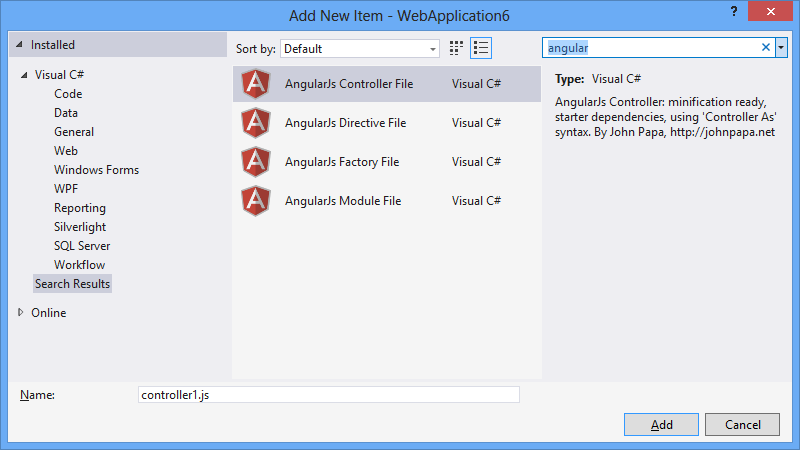

#SideWaffle for Visual Studio

[SideWaffle.com](http://sidewaffle.com) - download the extension

##The ultimate web developer template pack

A collection of Item Templates for Visual Studio 2012/2013 
that makes any web developer's life much easier.

  
The result of a search for "angular" in the "Add new item" dialog

##Add new templates##

1. Fork the project
2. Clone it to your computer
3. Install the [Visual Studio 2012 SDK](http://www.microsoft.com/en-us/download/details.aspx?id=30668) or [Visual Studio 2013 SDK](http://www.microsoft.com/en-us/download/details.aspx?id=40758).
4. Open the solution in Visual Studio
5. Watch [this video tutorial](http://youtu.be/h4VaORKgrOw)
6. After adding your templates, send us a pull request
 * Only high quality templates with broad appeal will be accepted

SideWaffle templates can be installed in both Visual Studio 2012 and 2013, regardless of the version you use for creating new templates.

Learn more about on MSDN about [customizing item templates](http://msdn.microsoft.com/en-us/library/ms247113.aspx)

###Releasing updates###

Here in the beginning, we are probably going to release updates 
rather frequently to get a feel for what the best user experience
might be. Expect that we will be moving toward a fixed schedule - 
for instance every 2-3 weeks - when we have more templates submitted
from the Visual Studio community.
